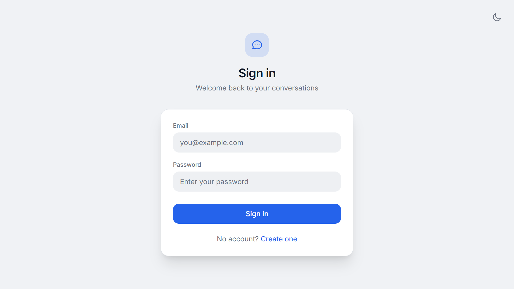
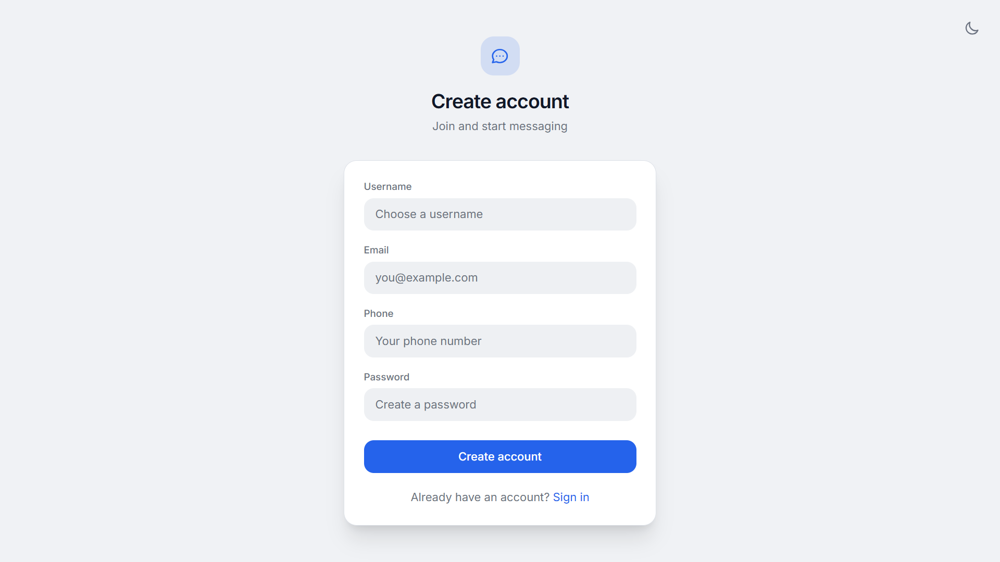
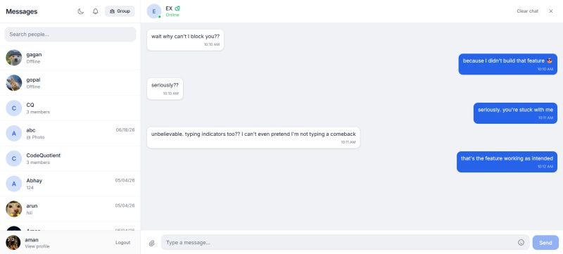

# 💬 ChatApp

> A full-stack real-time messaging platform with secure auth, image sharing, push notifications, and Redis-powered online status — built MERN-style with TypeScript end to end.

[](https://chat-app-psi-teal.vercel.app)


---

## 📌 About This Project

ChatApp is a modern real-time messaging platform built on a MERN-style stack with TypeScript across both frontend and backend. It goes well beyond a typical chat tutorial — featuring JWT authentication, Redis-backed online status, image/file sharing via Cloudinary, web push notifications, and a Bloom filter optimisation for fast signup checks.

🔗 **Live Demo:** [chat-app-psi-teal.vercel.app](https://chat-app-psi-teal.vercel.app)

---

## 📸 Screenshots

| Sign In | Create Account | Chat Interface |
|---------|-----------------|----------------|
|  |  |  |

---

## 🚀 Features

### Core
- 🔐 **Secure Authentication** — JWT-based signup and login with password hashing
- ⚡ **Real-Time Messaging** — Instant delivery via Socket.IO
- 💬 **Persistent Conversations** — Threaded chat history between users
- 🔍 **User Search** — Find users by name or phone number
- 🖼️ **Image & File Sharing** — Cloudinary-powered uploads, rendered inline in chat
- ↩️ **Reply to Messages** — Quote and reply within a thread
- 📩 **Invitations** — Send and accept chat invites

### Advanced
- 🔔 **Push Notifications** — Web Push API (VAPID) for new messages and invites
- 🟢 **Online Status** — Real-time presence tracking via Redis
- 🛡️ **Rate Limiting** — Redis-backed protection against message spam/abuse
- 🌸 **Bloom Filter** — Probabilistic check for username/email availability — fast, low DB load
- 🗄️ **Session Management** — Redis-managed sessions for scalable state
- 🎨 **Modern UI** — Custom-styled theme, mobile responsive, recently overhauled

---

## 🧠 How It Works

```
User signs up → Bloom filter checks availability → JWT issued
        ↓
User searches/invites another user → Invitation sent
        ↓
Invitation accepted → Conversation created
        ↓
Message sent → Socket.IO broadcasts in real-time
        ↓
Redis tracks online status + rate limits + session state
        ↓
Image attached? → Uploaded to Cloudinary → URL stored in message
        ↓
Recipient offline? → Web Push notification fires
```

---

## 🛠️ Tech Stack

| Layer | Technology |
|-------|------------|
| Frontend Framework | React + TypeScript |
| Build Tool | Vite |
| Styling | Custom CSS theme |
| State Management | React Context API |
| HTTP Client | Axios |
| Real-time Client | Socket.IO Client |
| Backend Runtime | Node.js + Express.js |
| Database | MongoDB (Mongoose ODM) |
| Cache / Sessions | Redis |
| Real-time Server | Socket.IO |
| Auth | JWT + bcrypt |
| File Storage | Cloudinary |
| Push Notifications | Web Push API (VAPID) |
| Uploads | Multer |
| CORS | cors middleware |

---

## 🧪 Key Features in Detail

| Feature | Description |
|---------|--------------|
| Real-time Messaging | Instant message delivery with Socket.IO |
| User Authentication | Secure signup/login with JWT and password hashing |
| Image Sharing | Upload images via Cloudinary, rendered inline in chat |
| Push Notifications | Web Push API with VAPID for browser notifications |
| Online Status | Real-time user presence via Redis |
| Chat Invitations | Send and accept conversation requests |
| Reply to Messages | Quote and reply to specific messages |
| Rate Limiting | Prevents abuse of sensitive API endpoints |
| Bloom Filter | Optimised username/email availability checks |
| Modern UI | Custom-styled theme with mobile responsiveness |

---

## 🧱 Backend Architecture

**MVC-style structure, fully modular:**

| Folder | Responsibility |
|--------|----------------|
| `server.js` | Entry point — Express init, DB connect, middleware, server start |
| `config/` | Redis client setup |
| `models/` | Mongoose schemas — User, Conversation, Messages, Invitation, PushSubscription |
| `controllers/` | Business logic — auth, user, conversation, message, invitation |
| `routes/` | REST endpoints mapped to controllers |
| `middleware/` | JWT auth guard, HTTP + Redis-backed rate limiters |
| `utils/` | Push notification dispatch logic |

**API Routes:**

| Endpoint | Purpose |
|----------|---------|
| `/api/auth` | Signup, login |
| `/api/users` | Search, profile updates |
| `/api/conversations` | Create, fetch conversations |
| `/api/messages` | Send, retrieve messages |
| `/api/invitations` | Create, accept invitations |
| `/api/push` | Push subscription management |

---

## 🎨 Frontend Architecture

```
src/
├── pages/        # Login, Signup, ChatLayout — top-level routes
├── components/   # Chat bubbles, message input, user lists
├── context/      # Auth state, theme — global providers
├── hooks/        # Custom reusable stateful logic
├── services/     # API communication layer
├── utils/        # Date formatting, string helpers
├── App.tsx       # Root component — routing + providers
└── main.tsx      # Entry point — renders to DOM
```

---

## 📂 Project Structure

```
ChatApp/
├── Backend/
│   ├── server.js
│   ├── package.json
│   ├── config/
│   │   └── redis.js
│   ├── models/
│   │   ├── User.js
│   │   ├── Conversation.js
│   │   ├── Messages.js
│   │   ├── Invitation.js
│   │   └── PushSubscription.js
│   ├── controllers/
│   │   ├── auth.controller.js
│   │   ├── user.controller.js
│   │   ├── conversation.controller.js
│   │   ├── message.controller.js
│   │   └── invitation.controller.js
│   ├── routes/
│   │   ├── auth.routes.js
│   │   ├── user.routes.js
│   │   ├── conversation.routes.js
│   │   ├── message.routes.js
│   │   ├── invitation.routes.js
│   │   └── push.routes.js
│   ├── middleware/
│   │   ├── auth.middleware.js
│   │   ├── httpRateLimiter.js
│   │   └── rateLimiter.js
│   └── utils/
│       └── sendPushNotification.js
├── frontend/
│   ├── index.html
│   ├── package.json
│   ├── vite.config.ts
│   └── src/
│       ├── App.tsx
│       ├── main.tsx
│       ├── pages/
│       ├── components/
│       ├── context/
│       ├── hooks/
│       ├── services/
│       └── utils/
├── .gitignore
├── LICENSE
└── README.md
```

---

## ⚡ Getting Started

### Prerequisites
- Node.js v16+
- MongoDB (local or Atlas URI)
- Redis (local or cloud)
- Cloudinary account (for image uploads)
- VAPID keys (for push notifications)

### 1. Clone the repository

```bash
git clone https://github.com/AMANkumar0004/ChatApp.git
cd ChatApp
```

### 2. Backend setup

```bash
cd Backend
npm install
```

Create a `.env` file inside `Backend/`:

```
PORT=5000
MONGODB_URI=mongodb://localhost:27017/chatapp
JWT_SECRET=your_jwt_secret
REDIS_URL=redis://localhost:6379
CLOUDINARY_CLOUD_NAME=your_cloud_name
CLOUDINARY_API_KEY=your_api_key
CLOUDINARY_API_SECRET=your_api_secret
VAPID_PUBLIC_KEY=your_vapid_public_key
VAPID_PRIVATE_KEY=your_vapid_private_key
```

Start the backend:

```bash
npm start
```

### 3. Frontend setup

```bash
cd frontend
npm install
npm run dev
```

App runs at **http://localhost:5173**

> Make sure both backend and frontend are running simultaneously for real-time functionality to work.

---

## 🎯 Future Improvements

- [ ] End-to-end encryption for messages
- [ ] Voice and video calls integration
- [ ] Message reactions (emojis, likes)
- [ ] Read receipts and typing indicators
- [ ] Group chats with admin controls
- [ ] Message search and filtering
- [ ] Dark/light theme toggle

---

## 👨‍💻 Author

**Aman Kumar** — `AMANkumar0004`

[](https://github.com/AMANkumar0004)

---

## 📄 License

MIT — free to use, modify, and distribute with attribution.

---

> *This README documents the architecture as of the latest commit (June 18, 2026). Implementation details may evolve as the project grows.*
